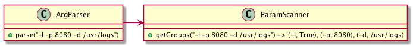
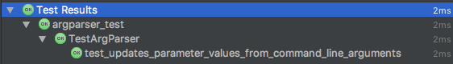
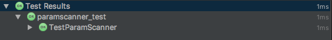
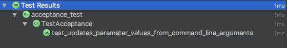

#AfterDojo
### The Args Kata
 
#HSLIDE


#HSLIDE

> The arguments passed to the program consist of flags and values. Flags should be one character, preceded by a minus sign. Each flag should have zero, or one value associated with it.

#HSLIDE

> `./myprogram -l -p 8080 -d /usr/logs`


#HSLIDE


#HSLIDE

# 1. Acceptance Test (failing!)

#HSLIDE

```python
class TestAcceptance(unittest.TestCase):
    def test_updates_parameter_values_from_command_line_arguments(self):
        
```

#HSLIDE

Arrange! 
```python
class TestAcceptance(unittest.TestCase):
    def test_updates_parameter_values_from_command_line_arguments(self):
        parser = ArgParser(schema={"-l", ("-p", 8000), ("-b", "/usr/log")})
```

#HSLIDE
Act! 
```python
class TestAcceptance(unittest.TestCase):
    def test_updates_parameter_values_from_command_line_arguments(self):
        parser = ArgParser(schema={"-l", ("-p", 8000), ("-b", "/usr/log")})
        parser.parse("-l -p 8080 -b /usr/local/log")
```

#HSLIDE
Assert!
```python
class TestAcceptance(unittest.TestCase):
    def test_updates_parameter_values_from_command_line_arguments(self):
        parser = ArgParser(schema={"-l", ("-p", 8000), ("-b", "/usr/log")})
        parser.parse("-l -p 8080 -b /usr/local/log")
        self.assertEqual(parser.get("-l"), True)
        self.assertEqual(parser.get("-p"), 8080)
        self.assertEqual(parser.get("-b"), "/usr/local/log")
```

#HSLIDE

# 2. Unit Test (failing!)

#HSLIDE


#HSLIDE

Introducing a Collaborator: `ParamScanner`



#HSLIDE

with *mocking*! 
```python
class TestArgParser(unittest.TestCase):
    def test_updates_parameter_values_from_command_line_arguments(self):
        with patch('argparser.ParamScanner.get_groups') as mock:
            mock.return_value = [
                ("-l", True),
                ("-p", "8080"),
                ("-b", "/usr/local/log")
            ]
            parser = ArgParser(schema={"-l", ("-p", 8000), ("-b", "/usr/log")})
            parser.parse("-l -p 8080 -b /usr/local/log")
            self.assertEqual(parser.get("-l"), True)
            self.assertEqual(parser.get("-p"), 8080)
            self.assertEqual(parser.get("-b"), "/usr/local/log")
```


#HSLIDE


```
with patch('argparser.ParamScanner.get_groups') as mock:
    mock.return_value = [
        ("-l", True),
        ("-p", "8080"),
        ("-b", "/usr/local/log")
    ]
```

#HSLIDE



#HSLIDE

```python
class TestParamScanner(unittest.TestCase):
    def test_splits_command_line_arguments_in_groups(self):
        self.assertEqual(ParamScanner().get_groups("-l -p 8080 -b /usr/local/log"), [
            ("-l", True),
            ("-p", '8080'),
            ("-b", "/usr/local/log")])
```

#HSLIDE


#HSLIDE

Regex + python `Falsy` magic
```python
class ParamScanner:
    def get_groups(self, command_line_arguments):
        pattern = \
            re.compile(r"(?:(?P<key>-[a-zA-Z])\s+(?P<value>[^\s\-]+)*)")
        groups = [(key, value or True) for key, value in pattern.findall(command_line_arguments)]
        return groups
```

#HSLIDE

`r"(?:(?P<key>-[a-zA-Z])\s+(?P<value>[^\s\-]+)*)"`

#HSLIDE
```python
groups = [(key, value or True) 
            for key, value in 
                pattern.findall(command_line_arguments)]
```

#HSLIDE




#HSLIDE


#HSLIDE


